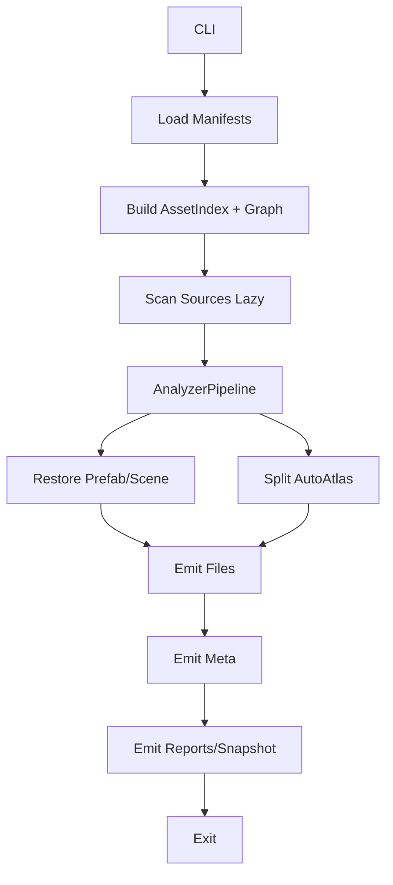

## 现状概览
当前工具定位为 **Cocos Creator 2.x（重点 2.4 系列）构建产物的资源回溯/还原 CLI**。输入为 `input/assets/**`（多 bundle 结构，含 `config.json`、短 uuid 命名资源、packs/scene/prefab/texture/spine/material 等），输出为 `output/**` 的 Creator 可重导入工程资源（真实文件 + `.meta` + `.fire/.prefab/.anim/.plist/.mtl/.effect` 等）。典型场景是对已发布 Cocos 游戏进行资源结构恢复、依赖补全与可视化再导入。

入口在 `src/main.js`，解析 CLI 参数并调用 `src/revert.js: revert.start()`。核心模块包括：  
- 扫描建表与主流程编排（`src/revert.js`）  
- bundle manifest 解析与类型/路径绑定（`src/bundle-config.js`）  
- packs/paths 语义分析补全（`src/analyzer.js`）  
- Scene/Prefab 反序列化再序列化（`src/revert-prefab.js`）  
- 自动图集拆分（`src/auto-atlas.js`）  
- 各类资源文件/文本生成（`src/generators.js`）  
- `.meta` 与映射输出（`src/revert-meta.js`）  
- 可选脚本拆分分析（`src/analysis/*`，默认未启用）

---

## 主要问题与证据
从架构、数据一致性、可扩展性/稳定性/性能看，现状主要风险如下（括号内标注文件/函数）：

1. **全局可变状态过多，生命周期不清晰**  
   - `GAnalys/GConfig/GMap*` 等散落在全局单例（`src/revert-state.js`），被多阶段随意读写。  
   - 不同阶段对同一字段的约定隐式且易冲突（比如 `frames/plists/material/sbines/spanim/fileout` 何时“完整”没有明确边界）。  
   - 结果：难以定位错误来源、难以增量恢复/回滚。

2. **模块职责边界模糊、强耦合“this 上下文”**  
   - `src/revert.js` 把 helpers/analyzer/generators/bundle-config 等大量函数 `...spread` 到一个对象上，依赖 `this.correctPath/this.isPicture` 等隐式方法。  
   - 任何函数无法独立复用/测试，调用顺序稍变就会“this 不匹配”。（如 `bundle-config.parseBundleConfig`、`generators.copyFiles`、`analyzer.analys*` 均依赖 `this`）

3. **扫描 + manifest 解析双来源导致一致性隐患**  
   - 先按文件名/扩展扫描建 `GAnalys`（`revert.start` 第二次 `walkSync`），后按 `config.json` 再绑定 `ttype/fileout`（`bundle-config.parseBundleConfig`）。  
   - 对缺失/重名/多态资源的处理分散在多处兜底逻辑中，易产生“同 uuid 多记录/错误类型覆盖”。（`bundle-config.parseBundleConfig`、`analyzer.analystextureSetter`、`generators.copyFiles`）

4. **错误处理与诊断弱，且大量吞异常**  
   - `try/catch { continue; }` 贯穿 analyzer/prefab/generators（`src/analyzer.js`、`src/revert-prefab.js`、`src/generators.js`），无统一日志/错误等级/上下文。  
   - 一旦某类资源解析失败，后续阶段仍继续，输出可能“看似成功但缺资源”。

5. **性能与内存开销偏高**  
   - 全量 `readFileSync` 把所有资源内容读入内存（`revert.start` 扫描阶段），对大工程非常重。  
   - 多轮遍历 `GAnalys/GConfig`（analyzer/generators/meta 多次全表扫描）时间复杂度高。  
   - 图集拆分与生成阶段串行执行，无法利用并发。（`auto-atlas.SplitAutoAtlas`）

6. **路径/命名与 Creator 规则对齐不足**  
   - `correctPath()` 简单过滤非法字符但没做到“与 manifest 同源的规范化策略”，特殊情况（redirect、nativeBase、importBase）未覆盖。（`src/utils/helpers.js`）  
   - `DirUtils.walkSync` 用 `bundleName || entry.name` 推断 bundle，深层结构可能被误判。（`src/utils/dir-utils.js`）

7. **可插拔/版本适配能力不足**  
   - 所有类型分支写死在 analyzer/generators/meta 中，新增资源类型或适配 2.3/2.4/2.4.15 细微差异只能堆 if/else。  
   - `parseclass.js` 复刻引擎反序列化是优点，但缺少“版本 guard / feature flag”。

---

## Cocos 2.4.15 序列化对标要点
结合 Creator 2.4.15 的资源序列化/加载体系，可借鉴的关键机制：

1. **Bundle Manifest（`config.json`）作为唯一权威来源**  
   - 解决的问题：在 build 产物里 **uuid ↔ 路径 ↔ 类型 ↔ pack/scene/deps** 的稳定映射。  
   - 核心结构：`paths/types/uuids/packs/scenes/deps/redirect/importBase/nativeBase/ver`。  
   - 可迁移：本工具应先解析 manifest 生成 `BundleManifest` 与 `AssetIndex`，再决定哪些源文件需要扫描/加载，避免“文件名推断优先”。

2. **短 UUID 压缩/解压一致性 + 版本约束**  
   - 解决的问题：减小 build 体积，仍可稳定还原。  
   - 本工具已有 `uuid-utils.decompressUuid()`；应增加 **manifest ver 检测** 与短 uuid 统一解压入口，避免各处重复/漏解压。（对标 `cc.assetManager.utils.decodeUuid` 行为）

3. **反序列化是“按需/延迟 + 依赖解析”的**  
   - Creator 通过 `cc.deserialize`/`deserializeAsAsset` 在需要时解析对象，并借 `__uuid__` 收集依赖图。  
   - 可迁移：  
     - 建立 `DependencyGraph`：由 manifest + 反序列化扫描 `__uuid__/__type__` 引用生成；  
     - 避免全量读入内容，改为 **lazy load + 缓存**。

4. **Meta/Importer 模板化**  
   - `.meta` 中 `importer/ver/subMetas/rawTextureUuid/...` 是按资产类型模板生成的。  
   - 可迁移：把 `revert-meta.js` 中的多函数拆为 **类型驱动的 MetaEmitter**，并将版本号/字段差异抽成配置表（便于 2.4.15 精确对齐）。

5. **packs/redirect 的语义**  
   - packs 是“资源组合/预加载单元”；redirect 用于替换 uuid 或路径。  
   - 可迁移：  
     - packs 解析与资源语义补全应先在“索引层”完成；  
     - redirect/scene 兜底逻辑应集中在 manifest 解析阶段，而非分散在 analyzer/prefab。

---

## 优化后的整体逻辑框架（目标架构）

### 分层与职责
1. **CLI & 配置层**
   - `cli/main`：参数解析、运行模式（仅资源/含脚本/仅索引/增量等）  
   - `config/VersionGuard`：检测 manifest 版本、目标 Creator 版本（2.4.15）特性开关

2. **索引/上下文层**
   - `Context`：一次运行的唯一状态容器  
   - `BundleManifestLoader`：读取每个 bundle `config.json` → `BundleManifest`  
   - `AssetIndexBuilder`：基于 manifest 构建 `AssetRecord` 表与 `BundleRecord`、`DependencyGraph(初始)`  
   - `SourceScanner`：仅对 manifest 指定的 uuid/路径补扫源文件（不再全目录盲扫）

3. **分析/补全层（可插拔 Analyzer）**
   - `AnalyzerPipeline`：按顺序执行分析器，每个分析器只读写 `Context` 中明确字段  
   - 内置 analyzers：  
     - `TextureFrameAnalyzer`（frames/_textureSetter/plist/atlas）  
     - `SpineDragonBonesAnalyzer`（sbines/png 绑定）  
     - `MaterialEffectAnalyzer`（effect/mtl/纹理回链）  
     - `AnimationClipAnalyzer`（spanim/frames refs）  
     - `BitmapFontAnalyzer`  
   - 每个 analyzer 输出 `Diagnostics`（warning/error + uuid + 来源）

4. **还原/转换层**
   - `PrefabSceneRestorer`：基于反序列化对象与依赖图生成 `.fire/.prefab`  
   - `AutoAtlasSplitter`：对确定为 auto-atlas 的纹理做裁切，生成新 `AssetRecord`

5. **输出层（Emitter）**
   - `FileEmitter`：copy / text/json / anim / plist / fnt / mtl / effect 统一落盘  
   - `MetaEmitter`：按类型模板生成 meta（与 2.4.15 字段对齐）  
   - `ReportEmitter`：输出 `mapsubs/mapplist/mapframe/diagnostics.json`

6. **扩展层（Plugin）**
   - `ScriptExtractorPlugin`（对应 `src/analysis/*`）  
   - `CustomTypePlugin`：新增资源类型/特定游戏结构适配

### 依赖方向图
```mermaid
flowchart LR
  CLI --> Context
  CLI --> ManifestLoader
  ManifestLoader --> AssetIndexBuilder
  AssetIndexBuilder --> Context
  SourceScanner --> Context

  Context --> AnalyzerPipeline
  AnalyzerPipeline --> PrefabSceneRestorer
  AnalyzerPipeline --> AutoAtlasSplitter

  PrefabSceneRestorer --> FileEmitter
  AutoAtlasSplitter --> FileEmitter

  Context --> FileEmitter
  Context --> MetaEmitter
  Context --> ReportEmitter

  AnalyzerPipeline <-- PluginAnalyzer
  CLI <-- PluginMode
```
依赖只允许“上层 → 下层”，禁止输出层回写分析层；所有阶段只通过 `Context` 交互。

### 关键数据模型与生命周期
- `BundleManifest`  
  - 字段：`name, ver, importBase, nativeBase, paths[], types[], uuids[], packs{}, scenes{}, deps[], redirect{}`  
  - 生命周期：启动加载 → 全程只读

- `AssetRecord`（替代 `GAnalys/GConfig` 的统一模型）  
  - 核心字段：  
    - `uuid, bundle, type, path, ext, sourcePath, outPath`  
    - `kind: {import,native,virtual}`  
    - `contentRef`（lazy 读取的句柄/缓存 key）  
    - `features: {frames, plist, bitmap, sbine, material, anim}`  
    - `deps: uuid[]`（来自 manifest + 反序列化扫描）  
    - `status: {indexed, analyzed, restored, emitted}`  
  - 生命周期：`indexed` → analyzers 逐步补全 → restorer/splitter 产生派生记录 → emitters 落盘

- `DependencyGraph`  
  - `nodes(uuid)->AssetRecord`  
  - `edges(uuid)->deps[]`  
  - 用途：恢复 prefab/scene、确定输出顺序、检测循环依赖

- `Diagnostics`  
  - `{level, uuid, bundle, phase, message, stack?}`  
  - 生命周期：各阶段累积 → 最终报告

- `RestoreSnapshot`（可选）  
  - 保存 `Context` 的阶段性快照，支持断点续跑/回滚。

---

## 优化后的执行流程

### 步骤
1. **CLI 启动**（`cli/main`）  
   - 解析参数：输入根、输出根、目标版本（默认 2.4.15）、运行模式（全量/增量/含脚本）。  
   - 初始化 `Context`、`Diagnostics`、输出目录策略。

2. **加载 Manifest 并建索引**  
   - `BundleManifestLoader` 扫描 `**/config.json` → `BundleManifest[]`。  
   - `AssetIndexBuilder` 基于 manifest 生成 `AssetRecord`：  
     - 解压所有短 uuid；  
     - 绑定 `type/path/outPath`（按 EXT_MAP + 2.4.15 规则）；  
     - 初步填 `deps`（manifest deps/packs/scenes）。  
   - `DependencyGraph` 建初始边（manifest 层）。

3. **按需扫描源文件**  
   - `SourceScanner` 只读取索引指向的 `sourcePath`：  
     - 图片/二进制取 size/headers；  
     - json/bin 不立即解析，挂 `contentRef`（lazy）。  
   - 缺失文件写 `Diagnostics error`，标记为 `status=missing`。

4. **AnalyzerPipeline（多阶段、可插拔）**  
   依次执行：TextureFrame → BitmapFont → Spine/DragonBones → Material/Effect → AnimationClip → Others  
   - 每个 analyzer：  
     - 只关注自己的字段（如 frames/material/sbine/spanim）  
     - 通过 `deserialize(contentRef)` 解析时自动收集 `__uuid__` 依赖回填到 `DependencyGraph`  
     - 产出结构化 diagnostics  
   - 结束后 `DependencyGraph` 完整。

5. **Prefab/Scene 还原**  
   - `PrefabSceneRestorer` 遍历图中 `cc.SceneAsset/cc.Prefab`：  
     - 反序列化 → 再序列化 `.fire/.prefab`  
     - 引用统一转 `{__uuid__}`，按图补齐缺失子资源  
   - 循环依赖检测：若图中存在环，按 Creator 规则断开非强引用边并提示。

6. **AutoAtlasSplitter**  
   - 根据 frames+manifest 规则识别 auto-atlas；  
   - 并发裁切（按 atlas 粒度限流），生成新 `AssetRecord(kind=virtual)`；  
   - 更新图与索引。

7. **输出阶段（Emitters）**  
   - `FileEmitter` 按资源类型顺序落盘：copy native/import、生成 json/text/anim/plist/fnt/mtl/effect 等。  
   - `MetaEmitter` 按模板生成 `.meta`（含 subMetas），版本号与字段对齐 2.4.15。  
   - `ReportEmitter` 输出 `mapsubs/mapplist/mapframe/diagnostics.json` 与可选 snapshot。

8. **收尾与退出**  
   - 若存在 `error` diagnostics：返回非 0 退出码，附简要汇总；  
   - 否则提示成功与统计。

### 流程图


### 异步/错误/回滚策略
- **异步点**：源文件扫描、图集裁切、批量 emit 可并发；使用队列限流（按 bundle/atlas 维度）。  
- **错误策略**：  
  - `missing/parse error` 不直接终止，但会阻断依赖链的还原输出；  
  - 对关键入口资源（scene/prefab）失败可配置 `fail-fast`。  
- **回滚**：  
  - 以阶段快照为界（索引/分析/拆图/输出），支持重新跑后段；  
  - 输出层先写临时目录，阶段成功再原子替换到 `output/`。
- **边界条件处理**：  
  - 缺失资源：保留引用但输出 diagnostics，meta 中标记 MissingScript/Null asset；  
  - 版本不一致：VersionGuard 根据 manifest ver 与目标 2.4.15 差异切换模板/解析器；  
  - 循环依赖：图上检测 SCC，按 Creator 的弱引用规则降级为延迟解析或断边。

---

## 重构落地计划（分阶段/优先级）

**P0（稳定性/可维护性优先）**  
1. 引入 `Context + AssetRecord`，把 `GAnalys/GConfig/GMap*` 迁入 Context，禁止跨模块直接 require 全局表。  
2. 把 `revert` 大对象拆成 `PipelineRunner` + 明确阶段函数；移除 `this` 隐式依赖（改为显式传 Context）。  
收益：职责清晰、可测试、降低隐式耦合风险。  
回退点：保留旧 `revert.start` 入口，双跑对比输出。

**P1（流程对齐 manifest + 性能）**  
3. 先 Manifest 建索引、后按需扫描源文件；缩减全量读内存。  
4. 把 analyzer 拆成独立模块并通过 `AnalyzerPipeline` 注册执行顺序。  
收益：一致性与性能提升，新增类型更容易。  
风险：顺序依赖变化需严格回归样本。

**P2（输出模板化 + 2.4.15 精准对齐）**  
5. Meta/File 输出改为 `Emitter` 模式，按类型模板表驱动（集中版本字段）。  
6. 依赖图驱动输出顺序与兜底策略。  
收益：跨版本适配、减少散落 if/else。  
风险：模板字段对齐需用真实工程验证。

**P3（能力增强）**  
7. 引入并发限流、增量/断点 snapshot、diagnostics 报告。  
8. 把脚本拆分（`src/analysis/*`）改为插件。  
收益：大工程处理时间降低、可扩展。  
风险：并发带来 I/O 竞争，需要压测。

---

## 需要你补充的信息
1. 你希望重点适配的 build 产物形态：仅 `assets` 还是 `assets+src/settings.js` 全量？  
2. 真实样本中是否存在大量 `redirect/nativeBase/importBase` 非默认情况？（这会影响索引与输出路径规则）  
3. 目标输出是“可在 Creator 2.4.15 直接打开工程”，还是“资源结构尽量还原即可”？不同目标会影响 Prefab/Scene 的容错与补全策略。

